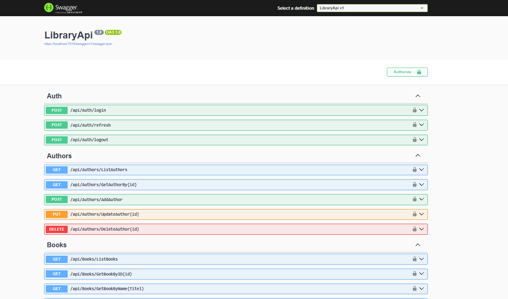
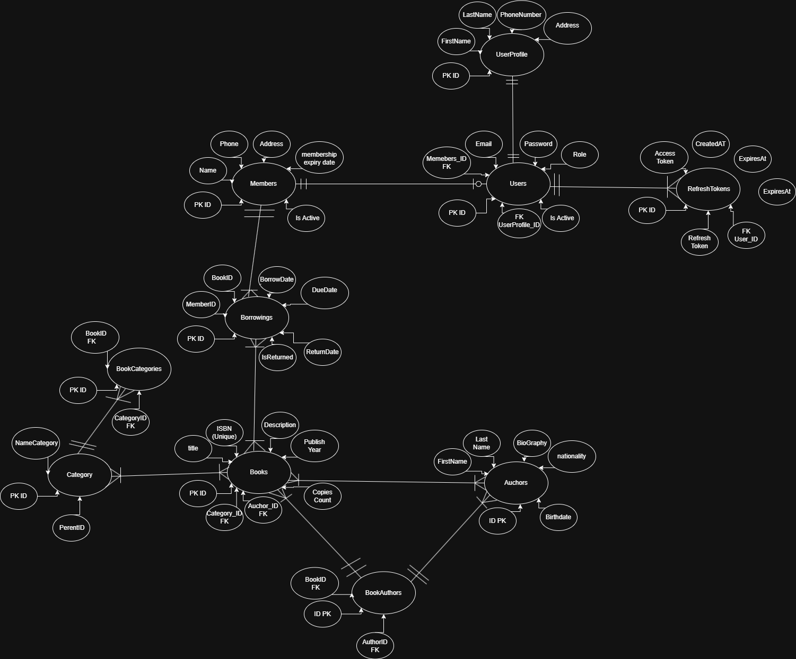

# Library Management System API

A secure and scalable ASP.NET Core Web API for managing a library system. The project follows a layered architecture and implements authentication, authorization, borrowing management, auditing, and security best practices.

---

## Overview

This project was developed to simulate a real-world library management system where users can register, become library members, borrow books, return books, and manage their profiles.

The API includes modern backend concepts such as:

- JWT Authentication
- Refresh Tokens
- Role-Based Authorization
- Ownership-Based Authorization
- Rate Limiting
- Audit Logging
- Secure Password Hashing
- Repository Pattern
- Service Layer Architecture

---

## Screenshots

### Swagger Documentation



### Database Diagram



---

## Features

### Authentication & Security

- User Registration
- User Login
- JWT Access Tokens
- Refresh Tokens
- Refresh Token Rotation
- Logout with Token Revocation
- BCrypt Password Hashing
- API Key Protection
- Role-Based Authorization
- Ownership Checks
- Rate Limiting Protection
- Security Audit Logging

---

### User Management

- Create User Account
- Update User Information
- View User Profile
- User Self-Service Access
- User Ownership Validation

---

### Member Management

- Register as Library Member
- View Personal Membership Information
- Update Membership Information
- Membership Expiration Tracking
- Active Membership Validation

---

### Author Management

- Create Author
- Update Author
- Delete Author
- List Authors
- Get Author By Id

---

### Category Management

- Create Category
- Update Category
- Delete Category
- List Categories
- Get Category By Id

---

### Book Management

- Create Book
- Update Book
- Delete Book
- List Books
- Get Book By Id
- Book Availability Tracking
- Available Copies Management

---

### Borrowing System

- Borrow Book
- Return Book
- Borrowing Validation Rules
- Active Borrowings Tracking
- Overdue Borrowings Detection
- Borrowing Limits Enforcement

---

### Dashboard & Reporting

- Total Books
- Total Authors
- Total Categories
- Total Members
- Active Borrowings
- Overdue Borrowings
- Unavailable Books

---

### Auditing

The system tracks critical actions:

- LOGIN
- FAILED_LOGIN
- BORROW_BOOK
- RETURN_BOOK

Audit information includes:

- User ID
- Action Type
- Entity Name
- Details
- Timestamp

---

## Technology Stack

### Backend

- ASP.NET Core Web API
- C#
- Entity Framework Core

### Database

- SQL Server

### Authentication

- JWT Bearer Authentication
- Refresh Tokens
- BCrypt Password Hashing

### Documentation

- Swagger / OpenAPI

### Security

- Rate Limiting
- API Key Protection
- Audit Logging

---

## Project Architecture

```text
LibraryApi
│
├── Controllers
│
BusinessLayer
│
├── Services
├── DTOs
│
DataAccessLayer
│
├── Repositories
├── Entities
├── AppDbContext
│
Database
│
└── SQL Server
```

---

## Database Structure

```text
Users
│
├── UserProfiles
├── Members
├── RefreshTokens
│
Borrowings
│
├── Books
│   ├── Authors
│   └── Categories
│
AuditLogs
```

---

## Security Features

### JWT Authentication

Users authenticate using JWT access tokens.

### Refresh Tokens

Long-lived refresh tokens allow generating new access tokens without re-authentication.

### Refresh Token Rotation

Every refresh request invalidates the old refresh token and generates a new one.

### BCrypt Password Hashing

Passwords are securely hashed before storage.

### Role-Based Authorization

Supported roles:

```text
Admin
Member
```

### Ownership-Based Authorization

Users can only access and modify their own resources unless they have administrator privileges.

### Rate Limiting

Authentication endpoints are protected against abuse and brute-force attacks.

### Audit Logging

Important security and business events are recorded for visibility and traceability.

---

## API Endpoints

### Authentication

```http
POST /api/auth/login
POST /api/auth/refresh
POST /api/auth/logout
```

---

### Users

```http
GET    /api/users/{id}
PUT    /api/users/{id}

GET    /api/users/profile
PUT    /api/users/profile
```

---

### Members

```http
POST   /api/members
GET    /api/members/me
PUT    /api/members/me
```

---

### Authors

```http
GET    /api/authors
GET    /api/authors/{id}
POST   /api/authors
PUT    /api/authors/{id}
DELETE /api/authors/{id}
```

---

### Categories

```http
GET    /api/categories
GET    /api/categories/{id}
POST   /api/categories
PUT    /api/categories/{id}
DELETE /api/categories/{id}
```

---

### Books

```http
GET    /api/books
GET    /api/books/{id}
POST   /api/books
PUT    /api/books/{id}
DELETE /api/books/{id}
```

---

### Borrowings

```http
POST   /api/borrowings
POST   /api/borrowings/return

GET    /api/borrowings/overdue
GET    /api/borrowings/member/{id}
```

---

### Dashboard

```http
GET /api/dashboard
```

---

## Getting Started

### Clone Repository

```bash
git clone https://github.com/YOUR_USERNAME/library-management-api.git
```

---

### Configure Database

Update your SQL Server connection string in:

```json
appsettings.json
```

Example:

```json
{
  "ConnectionStrings": {
    "DefaultConnection": "Server=.;Database=LibraryDb;Trusted_Connection=True;TrustServerCertificate=True"
  }
}
```

---

### Configure Environment Variables

Create the following environment variables:

```text
LIBRARY_JWT_SECRET
LIBRARY_API_KEY
```

Example:

```text
LIBRARY_JWT_SECRET=YourSuperSecretJwtKeyHere
LIBRARY_API_KEY=YourApiKeyHere
```

---

### Apply Database Migrations

```bash
dotnet ef database update
```

---

### Run Application

```bash
dotnet run
```

Swagger UI:

```text
https://localhost:{port}/swagger
```

---

## Future Improvements

- Email Verification
- Password Reset
- Search Books
- Book Reservations
- Reviews & Ratings
- Notifications
- Docker Support
- CI/CD Pipeline
- Unit Testing
- Integration Testing
- OpenTelemetry Monitoring
- Serilog Structured Logging

---

## Learning Objectives

This project demonstrates practical experience with:

- ASP.NET Core Web API
- Entity Framework Core
- SQL Server
- JWT Authentication
- Refresh Tokens
- Authorization
- Repository Pattern
- Service Layer Pattern
- DTO Mapping
- Audit Logging
- Rate Limiting
- Secure API Development

---

## Author

Developed as a backend portfolio project to practice modern ASP.NET Core API development, security, and software architecture principles.
